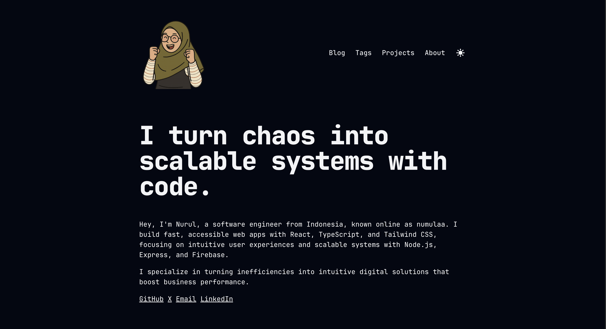

# numulaa.dev

This is my personal protfolio and blog - built with [Astro](https://astro.build/) and [TailwindCSS](https://tailwindcss.com/)

[]

## Live Site

[Live Site](https://numulaa-dev.vercel.app/) - You can visit the live site here. Deployed on Vercel.

## 🧞 Commands

All commands are run from the root of the project, from a terminal:

| Command                   | Action                                           |
| :------------------------ | :----------------------------------------------- |
| `npm install`             | Installs dependencies                            |
| `npm run dev`             | Starts local dev server at `localhost:4321`      |
| `npm run build`           | Build your production site to `./dist/`          |
| `npm run preview`         | Preview your build locally, before deploying     |
| `npm run astro ...`       | Run CLI commands like `astro add`, `astro check` |
| `npm run astro -- --help` | Get help using the Astro CLI                     |

It is inspired by the [Tailwind Next.js Starter Blog](https://github.com/timlrx/tailwind-nextjs-starter-blog) - one of the most popular Next.js blogging templates.
